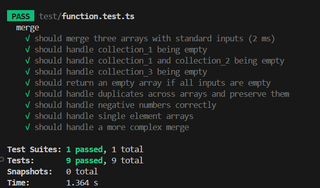

## TypeScript Merge Project

### 1. How to Setup Dependencies

run the following command to install all the development dependencies defined in package.json:

```sh
npm install
```

This will create a node_modules folder with all the necessary packages .

### 2. How to Execute Unit Tests

run the following command to execute unit tests:

```sh
npm run test
```

If all tests pass, you will see a success message:


